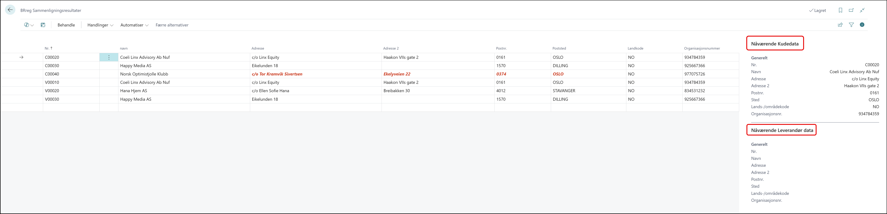
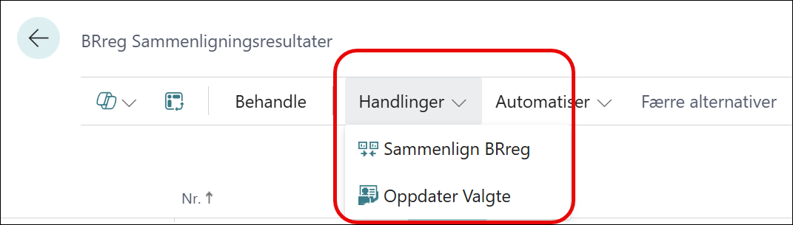

# Datavask ved oppstart

Etter installasjonen av BRreg appen så anbefaler vi å ta en synkroniseringssjekk med verktøyet Samenlingningsreultater.
Du finner denne ved å søke på sammenligning i forstørrelsed\sglasset på høyre side.

## Faktabokser

**Nåværende kundedata** Denne faktaboksen viser de gjeldene kundedata som ligger lagret i Business Central.
**Nåværende Leverandørdata** Denne faktaboksen viser de gjeldene leveradnørdata som ligger lagret i Business Central.

## Menypunkter

Menypunkt **Sammenlign BRreg** sammenligner kunder med organisasjonsnummer opp mot brreg.no. Verdier som ikke er like vil bli markert **røde**.
Menypunkt **Oppdater Valgte** Vil oppdatere alle valgte linjer med data fra brreg. de røde feltene vil da bli borte.
