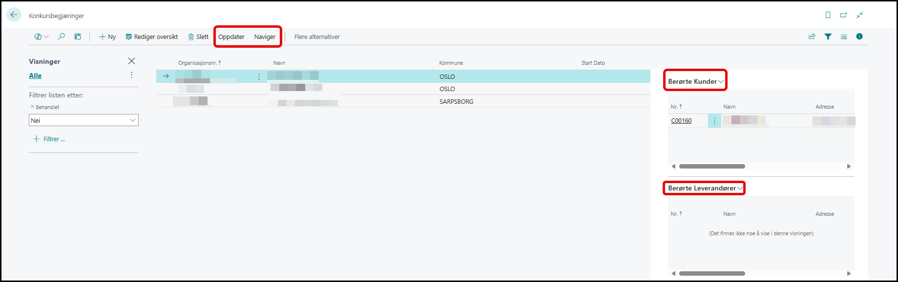
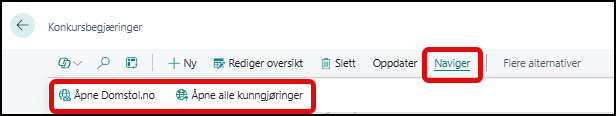
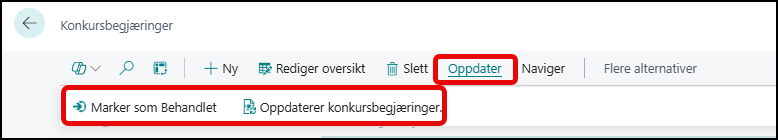

# Konkursbegjæringer

Dette er en egenutviklet tjeneste hos BDO som sjekker om dine kunder elller leverandører har pågående konkursbegjæringer under  behandling hos domstolene.

Ligger noen av dine kunder i denne listen bør de settes på en liste for nøyere oppfølging.

## Faktabokser

Til høyre så er det to faktabokser en for berørte kunder og en for berørte leverandører.

Her vil berørte kunder og leverandører for dette varslet bli listet opp.

Man kan da enkelt gå til den relevante kunden eller leverandøren og utføre de prosesser man har behov for ut fra varslet.

## Menypunkter

### Naviger

I menyen **Naviger** så finner vi disse menypunktene

Åpne Domstol.no - Denne vil åpne tilhørende sak på domstol.no
Åpne kunngjøringer - Denne vil åpne all kungjøringene på BRreg.no som tilhører organisasjonen.

### Oppdater

I menyen **Oppdater** så finner vi disse menypunktene

Marker som behandlet - Når organisasjoinen er behandlet etter interne prosedyrer så settes  varslet til behandlet.
Oppdater konkursbegjæringer - kjører oppdateringer av konkursbegjæringer manuelt.
