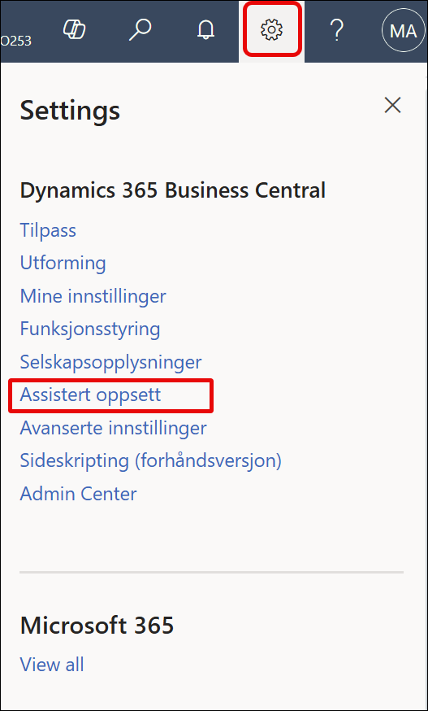
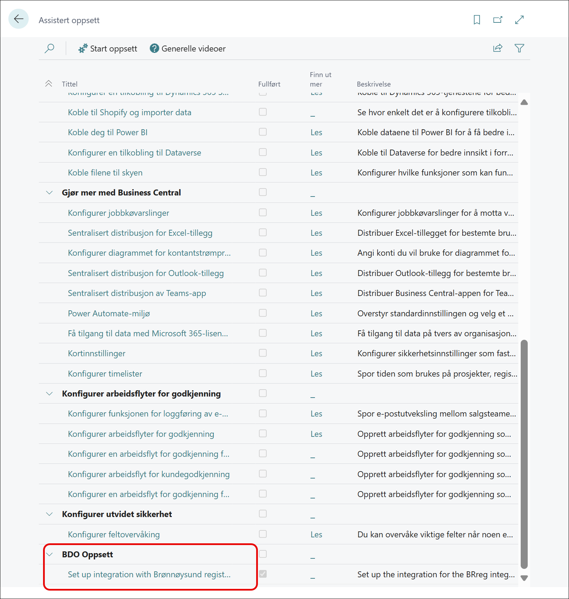
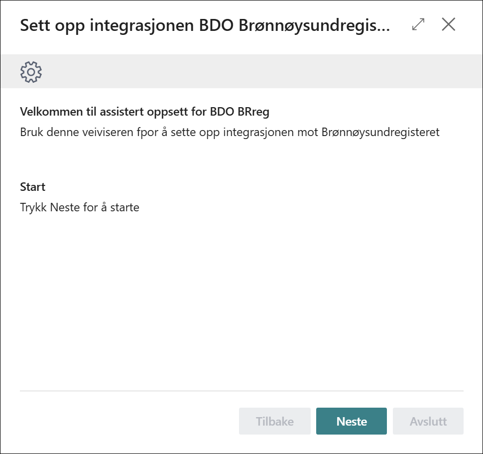
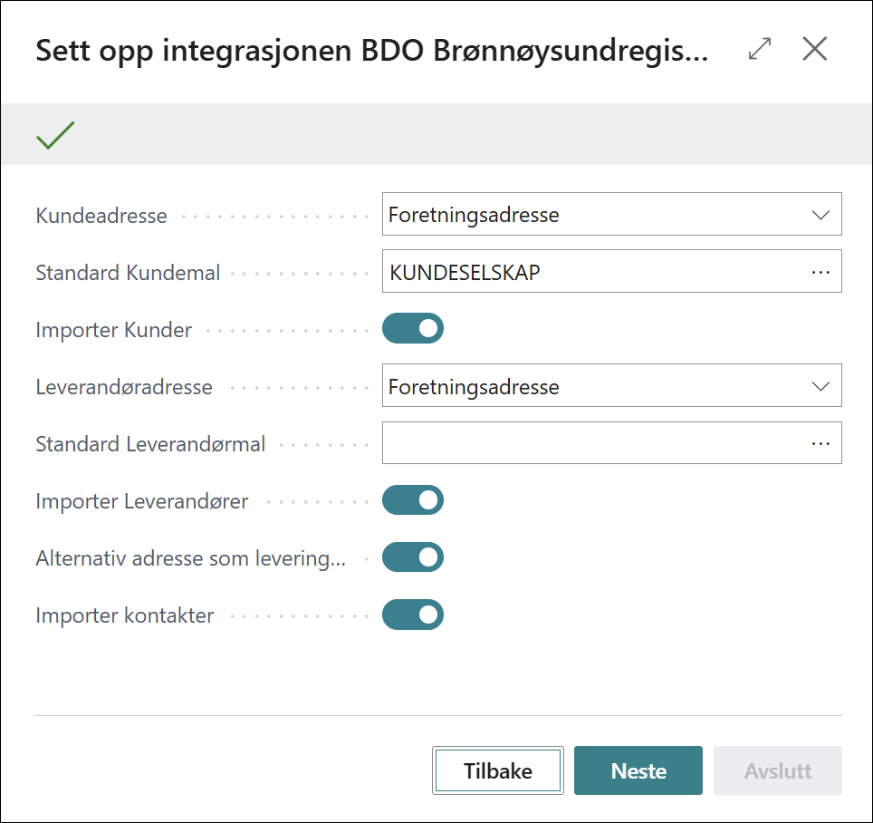
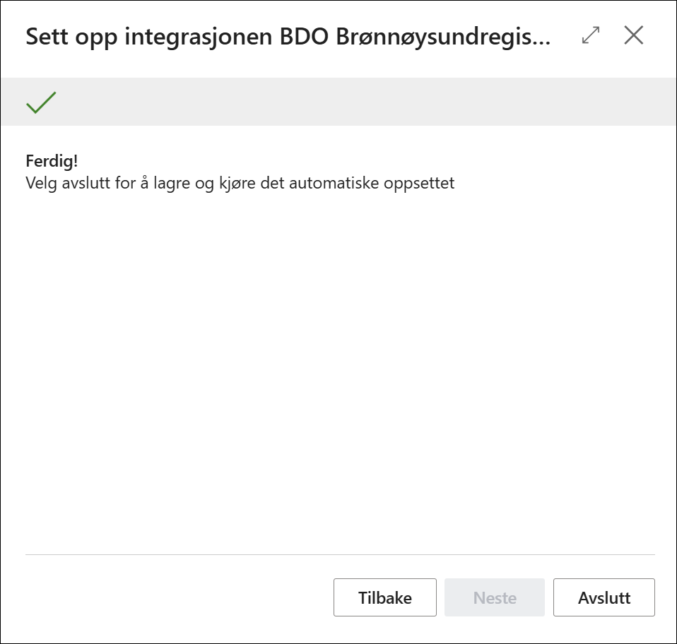

# Oppsett av integrasjonen

Den raskeste veien for oppsett er å kjøre veiviseren.
Den finner du under **Assistert oppsett** under tannhjullet for innstillinger.

eller du kan søke på **Assistert oppsett** under søkefunksjonen i førstørrelsesglasset.

På siden for assistert oppsett så finner du under BDO Oppsett en link for oppsett av  Integrasjon mot
Brønnøysund.

Trykk på **lenken** og veiviseren starter.

Oppstartsbildet ser slik ut:

Her trykker du **neste** og kommer til side 2:

Her er det noen valg du må ta:

- **Kundeadresse** Her kan du velge mellom foretningsadresse eller foretningsaddresse.
      Denne instillingen sier hvilken adresse som skal hentes fra Brønnøysundregisteret og vises på kundekortet.
  
- **Standard Kundemal** Angir hvilken kundemal som skal være standard kundemal ved opprettelse av kunder.
  
- **Importer Kunder** Angir om deter lov å importere kunder fra Brønnøysundregisteret.
  
- **leverandøraddresse** Her kan du velge mellom foretningsadresse eller foretningsaddresse.
      Denne instillingen sier hvilken adresse som skal hentes fra Brønnøysundregisteret og vises på leverandørkortet.
  **Standard Leverandørmal** Angir hvilken leverandørmal som skal være standard leverandørmal ved opprettelse av kunder.
  **Importer Leverandører** Angir om deter lov å importere leverandører fra Brønnøysundregisteret.

- **Alternativ Addresse som leveringsaddresse** Angir om om alternativ adresse skal opprettes som leveringsaddresse på kunden.
  **Importer Kontakter** Importerer kontakter/roller som er knyttet til organisasjonen.  
  
  Trykk **neste** og du kommer hit:

Da er du ferdig og trykker **Avslutt**.
Du ser den jobber litt og gjør seg ferdig. den leser inn data i underliggende tabeller automatisk.
