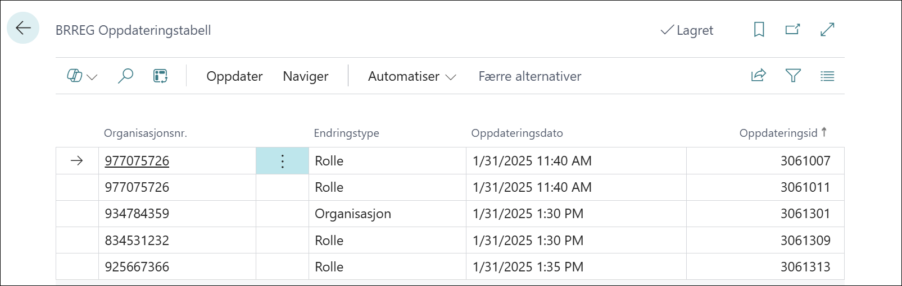
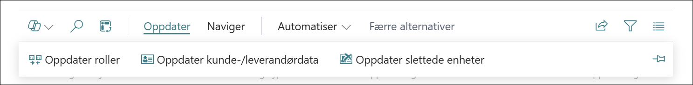
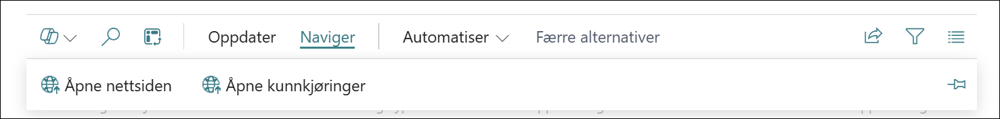

# Oppdateringsloggen

Her finner du alle oppdateringer som er klare for oppdatering av Business Central.

## Menypunkt Oppdater

- Menypunkt **Oppdater roller**Oppdaterer roller for aktuell organisasjon.
- Menypunkt **Oppdater Kunder og leverandører** Oppdaterer kunder og leverandører som er knyttet til organisasjonn med nye friske data fra BRreg.
- Menypunkt **Oppdater slettede enheter** setter feltet slettet på BRreg info på kunder og leverandører til slettet og datoen den er slettet fra BRreg.

## Menypunkt Naviger

- Menypunkt **Åpne Nettsiden** Denne knappen fører deg til organisasjonens side på BRreg.no.
- Menypunkt **Åpne Kunngjøringer** Denne kanappen tar deg til kunngjøringene for denne organisasjonen.
